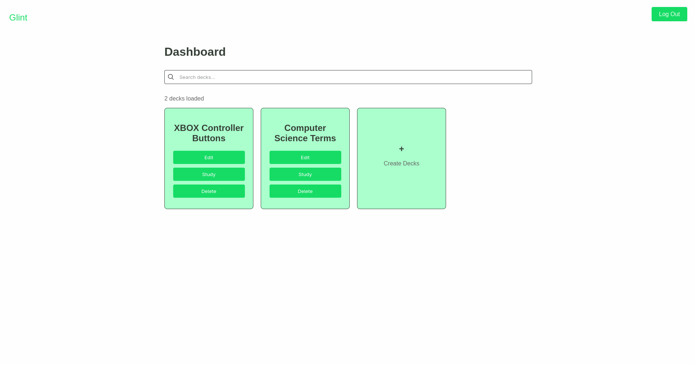

<h1 align="center">Glint (Web)</h1>

  <em>Fast - Elegant - Simple</em>

This repo holds the source for the web-frontend of the "Glint" project, allowing users to manage their card decks and account information through the web-app.

## Screenshots

  <em>Dashboard</em>

  <em>Deck Editor</em>

  <em>Card (Front)</em>

  <em>Card (back)</em>

